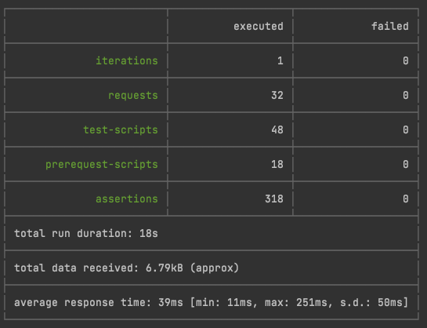

# 

[](https://github.com/raeperd/realworld-springboot-kotlin/actions/workflows/build-and-deploy.yml)
[](https://sonarcloud.io/summary/new_code?id=raeperd_realworld-springboot-kotlin)
[](https://sonarcloud.io/summary/new_code?id=raeperd_realworld-springboot-kotlin)
[](https://sonarcloud.io/summary/new_code?id=raeperd_realworld-springboot-kotlin)

Spring boot kotlin codebase containing real world examples (CRUD, auth, DDD) that adheres to
the [RealWorld](https://github.com/gothinkster/realworld) spec and API.

### [Demo](https://demo.realworld.io/) &nbsp;&nbsp;&nbsp;&nbsp;[RealWorld](https://github.com/gothinkster/realworld)

This codebase was created to demonstrate a fully fledged fullstack application built with **Spring boot kotlin**
including CRUD operations, authentication, routing, pagination, and more.

For more information on how to this works with other frontends/backends, head over to
the [RealWorld](https://github.com/gothinkster/realworld) repo.

# Getting started

## Run from scratch

```shell
$ ./gradlew bootRun
```

## Using docker

```shell
$ docker run --rm -it -p 8080:8080 ghcr.io/raeperd/realworld-springboot-kotlin:master 
```

## Run using MySQL as database

```shell
$ docker compose up 
```

- Configure backend database with flyway

```shell
$ SPRING_PROFILES_ACTIVE=develop ./gradlew bootRun
```

- Change profile to develop

## Running tests

### Using shell script

```shell
$ ./api/run-api-tests.sh
```

### Using gradle test

```shell
$ ./gradlew test
```

# How it works

- Spring Boot for Web API implementations
- Spring Data JPA for persistent layer
- H2 and MySQL for actual database
- Spring's `HandlerInterceptor` for security

## Package Structure

```text
./src/main/kotlin/io/github/raeperd/realworldspringbootkotlin/
├── domain
│   └── article
├── infrastructure
│   ├── jpa
│   └── security
│       └── jwt
└── web
    └── jwt
```

- domain contains only domain logic without explicit dependencies
- infrastructure contains implementation details with external dependencies
- web contains API endpoints and spring web configurations

## Design Principal

- Maintain 90% of code coverages
- Domain logics without external dependencies
- Allow-list for endpoints rather than block-list for authentication
- Reasonable database performance
    - Avoiding N + 1 query problems
    - Explicitly save entity

## Performance



- Result of [./api/run-api-tests.sh](./api/run-api-tests.sh) in M1 Mac with 16GM of ram

# See Also

- Java version implementation of this project from my
  repository [raeperd/realworld-springboot-java](https://github.com/raeperd/realworld-springboot-java)
- Another kotlin spring boot implementation
  project [gothinkster/kotlin-spring-realworld-example-app](https://github.com/gothinkster/kotlin-spring-realworld-example-app)